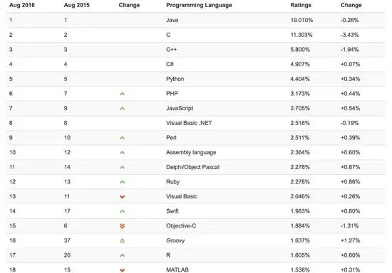

过去十年，编程语言领域有什么重要进展？
=====================================

2016-08-18 caoglish InfoQ

> 十年来，尽管软件行业发展迅速，热门编程语言的发展似乎却成了例外，始终未有太大改变。不过事实并不尽然，编程语言的真正变化在于：为了竞争存活，前十大热门编程语言都借鉴了其他语言的功能，作为新功能引入。究竟哪几方面变化明显？

> 本文转自知乎，已获作者授权

如果把当前TIOBE编程语言排行榜的前十拿出来，与十年前的前十做以比对，就会发现这两份名单完全相同！

唯一的不同在于：其中Visual Basic、PHP和Perl与同为十大热门却更现代的C#、Python和JavaScript交换了位置。在这十年间Objective-C确曾进入过十大热门语言，甚至还攀升到了前三的位置，不过在苹果宣布用Swift代替Objective-C之后，它便很快销声匿迹了。

根据这些情况，我们可以得出结论：编程语言并无实质性变化，而且未来十年也不会出现什么新的大型编程语言。

编程语言排行榜2016年8月 TOP 20 榜单

不过事实并不尽然，编程语言的真正变化在于：为了竞争存活，前十大热门编程语言都借鉴了其他语言的功能，作为新功能引入。由于十大热门语言的代码库都很庞大，使用者更愿意在该语言中实现变更，而不是换用新的编程语言。 编程语言内核是万变不离其宗。我个人看法是以下几个方面的变化比较明显

## 语言本身

### 工业标准

网页标准有 W3C 控制，尤其是浏览器的开发，所有主流的浏览器都会自觉符合这个组织的标准，当然这些开发商本身就是这个组织的成员。所以新的 HTML5、CSS3、ES6 JavaScript 的新特性得到顺利推动，让大部分主流浏览器都支持它，W3C 功不可没。

PHP 有 PHPFIG 组织，虽然不是强制性的，但是很多新的框架和库都自觉遵守这个组织的编程标准。

Java、C 语言都有各自的工业标准准则，来维护各自工业标准。

工业标准其实不是强制性的，虽然很多程序员在自己工作上不遵守这些工业标准，但是要推出新的模块的话，不遵守这些工业标准的模块，是没有人会去使用的。如今，是不是面向标准编程，这是体现一个程序员是否专业、一个模块是不是专业模块的一个重要指标。

### 第三方模块走红

各种语言的框架和库，可能比自己的语言还出名，比如 CSS 的 Bootstrap、JavaScript 的 jQuery；一个好的框架和库甚至可以推动这个语言的发展，比如 PHP 的 Laravel 框架、JavaScript 的 jQuery。

模块化的发展，大大加快了开发的速度。很多人也愿意开发各种框架和模块，不但可以锻炼自己的开发技能，也是一种展示自己的能力。

过去，程序员要成名，要开发出有用的软件，比如求伯君开发出了 WPS，牛；张小龙开发出了 Foxmail，牛。

现在，程序员要成名，可以开发出一个大家都会用的框架和模块。比如 Evan You 开发的 Vue.js，玉伯开发的 SeaJs。

### 模块化编程和依赖管理

在 2010 年前，依赖管理工具只是个很时髦的概念，大家都习惯到库的官方网站下载库后手动导入到项目中。升级也比较麻烦。所以，程序员一般是下载一两个必要的库，其他的库都自己手写完成。

如今，依赖管理工具已经是必备的了，大家不再手动导入库了；能找到第三方模块的功能，就不再自己编写了，全部用工具导入项目；自己编写的程序代码，能模块化的代码都模块化，甚至是独立出来，网上开源，然后使用依赖管理工具进行管理导入到自己的项目中。

这样做的优点很明显：

- 代码量减少；
- 加快开发速度；
- 高度解耦；
- 定位 bug 容易，改动影响小；
- 写单元测试容易。

如今大家更加愿意编写小模块，而不是重复造轮子了。

### 框架使用

现在一般会先选一个合适的框架，再开始编程，而不是所有功能完全靠自己从头开始编写。

- JavaScript 的框架多了，如Vue、React、Backbone、AngularJs 等;
- CSS 有 Bootstrap、Fundation 等；
- PHP 有 Laravel、CakePHP 等；
- C#有 MVC；
- Java 有 Spring+Hibernate+struts。

框架要先选好，模块在需要的时候慢慢加就行了。

### 测试代码

2006 年，单元测试在开发过程中，重要性不是很大，可有可无，只要程序完成，功能能用就行。

如今的代码，如果没有单元测试部分，这个工程就不能算完结。甚至是，测试驱动开发已经成为主流，先写测试代码，然后再开发。

测试代码的发展不仅仅是单元测试这部分。单元测试、集成测试、功能测试、性能测试、压力测试等，都在开发过程中占了重要的位置。以前测试都是由专门的测试员进行人工测试，或者由他们负责测试；如今单元测试和集成测试都是要开发者自己编写。

### 跨设备，跨平台

Java 提出的跨平台，一次编译到处运行的梦想，其实至今未很好实现。但是，如今跨设备、跨平台编程趋势是越来越明显了。

跨设备，主要是指跨桌面和手机，尤其是针对显示器的最佳实践是层出不穷，如今响应式成为了主流。

跨平台，出自于Java 的一个概念，如今已经普及了，桌面、手机、服务器、浏览器、嵌入式都能看到 JavaScript 的身影，这大大归功于 JavaScript 标准化的推广。跨平台过去是指一次编译到处运行，如今是指只要这个平台支持这个语言或标准，就能用。如今的跨平台编程，更讲究特性检查这个功能，如果你的平台没有这个特性，那么就关闭特性检查功能，但其他功能还可以继续使用。

今后，各种设备层出不穷，VR 头盔、AR 眼镜、巨型屏幕、物联网等，跨平台会有进一步的发展。

## 工程方面

### 工具化

编程语言工具化如今非常突出了，凡是工具能完成的事情，绝对不手工完成。从以下几个方面都可以找到相应工具，帮助开发者管理代码质量。

- 代码风格检查；
- 工业标准检查；
- 代码整理；
- 代码复杂度检查；
- 单元测试覆盖率检查；
- 依赖管理；
- 压缩代码；
- 重复代码检查；
- 无用代码检查。

### 工程化

工程化是近年来最突出的一个发展趋势，过去只是选择性的，现在是必须的。工程化是以工具化为基础的，没有工具，那么工程化也无从谈起。工程的核心就是流程自动化，又称为构建，这些包括了：代码质量检测、代码压缩、代码合并、代码优化、代码编译、单元测试等部分。构建就是把这些部分以工作流程的方式组合起来，然后用一个命令行运行整个流程。它有点像批处理，但是是程序开发中使用的特殊批处理。

网页编程现在又流行“实时编程”，就是当你在保存代码的时候，以上的构建流程工作完成后会自动刷新浏览器，保证新代码效果立刻反映在浏览器上。现在，在 GitHub 项目库中找软件，首先查看是否有工程文件，看看它的构建流程是什么，就知道这个项目的专业程度和项目质量了。如果没有配置一个工程化的流程系统，都不好意思说自己在做软件工程。

### 自动化

自动化是以工程化为基础的，工程化本身就是一种流程自动化，而自动化又在工程化的过程中更进一步自动化。

持续集成是全自动化的一个终极体现，主要流程是：版本控制库—构建—测试—报告。持续集成有点像 Windows 的定时任务，但它是程序开发专用的定时任务。

持续集成的特点就是全自动，一个项目一次配置好，要求不变的话，就不用管了；然后开发者不断把代码加入到版本控制库里就可以了，每当库有新代码时候，持续集成就会下载代码进行构建；当它完成构建和测试后，如果测试没有通过，就会返回报告，然后根据报告结果修改代码。

所以每次往版本库添加新代码，持续集成就会全自动地帮你构建和测试代码，尽快通知代码的问题。这样，程序员就可以更加集中精力编写功能代码和测试代码，而不用担心新代码是否会影响过去的代码。

在多人一起开发的时候，持续集成更有用，谁上传的代码没有通过测试，能马上知道。这样可以保证多人项目的代码顺利合并，体现“持续集成”的功效。

另外还有持续部署，其实就是持续集成在测试成功后部署上产品服务器的流程。如今有些网站一天就要部署几十次，有了持续部署后，部署多少次都毫无压力。

工具化、工程化以及自动化的关系很有意思，前者是后者的基础，而后者又极大推动了前者的发展。它们相互积极作用，相互推动了对方的发展，这形成了一个很好的良性循环。

## 其他方面

### 版本控制，Git、GitHub

版本控制在编程界中的地位是越来越重要了。在编程界中有个说法：没有版本控制的项目，就等于没有这个项目。

版本控制的工具过去有 SVN，如今是 Git 。 Git 很强大，用的人也是越来越多，它和 GitHub 共同对编程界的积极影响和积极推动，这是令人无法忽视的。比如几乎所有的依赖管理工具的库下载源，都是和 GitHub 绑定的， 就这一点来说，GitHub 的重要性在 IT 界就不可估量。

GitHub 和 Git 的方便管理、上传、查看、统计、bug 报告等功能更是极大地推动了程序员之间的合作；GitHub 上的开源更是改变了开源软件对世界的影响力。

GitHub 不是 Git 的全部，Git 也不是版本控制的全部。本质上来说，GitHub 只是一个网站而已；但 GitHub 确实又是这个编程世界不可缺少的一个重要模块，已经成为了一个不可或缺的组成部分。甚至， GitHub 已经跳出了编程界，成为了一个世界级的不可或缺的服务平台。

然而 GitHub 是 2008 年建立的，真正开始流行是在 2012 年。在 2015 年， Google 宣布关闭自己的 Google Code，可见 GitHub 的影响力，以及其在业界的重要程度了。

### 生态圈意识

生态圈意识在业界是越来越强了，它应该和编程工具化和工程化有极大的关系。一门语言、框架或者库出现后，人们应用它们，不只是因为它们本身的强大，更是因为它们背后的生态圈。

举个例子，人们选择一个 JavaScript 的框架，是选 React 还是选 Ember.js，更多是看支持它们的生态圈如何。React 是有 Facebook 支持的，有很多程序员为它开发相关工具和库以及有很多文档教程，这样 React 的生态圈就很大，会让更多人愿意选择 React 作为第一开发框架。而 Ember.js 相对来说生态圈小，选择它的人可能就不会很多。

选择语言也一样。选用 JavaScript 编写爬虫，还是选 PHP 或者 Python？更多的是看它们的生态系统了，Python 的爬虫库强大且丰富，所以更多人选用 Python 编写爬虫。

一门新的语言是否成熟，看的就是它的生态圈，比如是否有测试框架、 MVC 框架，是否有成熟的时间库、数据库 SDK 等，这些都是其必要的生态圈组成部分。

### WEB 技术的桌面化和 JavaScript 的全栈化

JavaScript 近些年发展火热，逐渐印证了Atwood定律：**凡是可以用 JavaScript 实现的，最终都会用 JavaScript 实现。**

- Node.js 的出现，奠定了JavaScript 走出浏览器，走向了服务器端；
- NW 的出现和 electron 正式版发布，JavaScript 走向了桌面；
- MongoDB 的出现，JavaScript 走向了数据库；
- Tessel 的出现，走向了硬件和物联网。

如今一个全栈系统，从前端到数据库，可以完全使用 JavaScript 一种语言。还有很多人正在致力于把 JavaScript 推向更多的领域中。

而 Web 技术（html+css+JavaScript）由于 NW 和 Electron 的出现，已经可以编写桌面程序了。正是由于 JS 的优秀模块很多，以及 HTML+CSS 的界面容易编写和掌控，纠错工具丰富，很多人愿意用 Web技术进行开发。现在比较火的桌面工具有 VS-Code 编辑器和 Atom 编辑器。

由于 Web 技术的便利性，Web 技术涉及的领域也就越来越多，再也不是浏览器的专利了。

### Web API 的全面发展

Web API 虽然历史悠久，但是真正使其推广流行的应该是 Twitter，而后移动设备的普及使其得到更大发展和普及。移动设备如果没有 Web API 基本就不能工作。Web API 的普及，也使得网络服务之间相互连通，形成一个更大的服务网络。总之，如今的 Web API 已经是不可或缺的存在了。

Web API 更多是一种服务，或是一种数据交换模式。只要语言带有 HTTP 的网络访问功能，就都能使用。提供 Web API 的公司，发布 Web API 后，一般也会同时发布一些常用语言的 SDK，方便语言开发人员快速上手；但是如果语言比较小众，没有提供相应的 SDK 也没有关系，编写一段 HTTP 的请求，也可以交换数据。

从编程的角度来归纳一下 Web API 特点就是：

- 容易编写，就是一个函数，无需界面；
- 语言无关性，无论 Web API 是哪一门语言编写的，几乎任何语言都能调用；
- 访问性好，只要网络能访问，Web API 就可以用。

### 语言之间的相互借鉴

语言之间的相互借鉴也越来越明显了，比如:

- PHP 5.0 后支持了类，5.4 后支持了 Trait，5.5 后支持了生成器（Generator）；
- JavaScript ES 6 支持了箭头匿名函数、生成器（Generator）、类（不是 Prototype 的类）；
- C# 和 Java 相互借鉴；
- Coffee Script 借鉴 Python 和 Ruby。

与其说是相互借鉴，不如说随着语言的发展，一些语言概念逐渐成为了标配，如果没有，就不算是完整的语言了，比如说类、匿名函数、常用数据结构等都成为了标配。

### 语言解析器的工具化

语言解析器（Parser）在过去是作为编译器的一部分存在的。如今，它已经独立出来作为一个模块或者工具使用了。这对于语言的生态有着很大的意义，促进了语言生态圈的良好发展。

独立出来的解析器，可以用来编写以下和语言有关的工具，这些工具都是用来优化代码质量、提高编码体验的。

- 语法检查，JavaScript 的 JSHint 用的就是 JavaScript 的一个解释器，被 JavaScript 重新解释一遍，把可能有问题的地方标记出来通知程序员，程序员可修改避免潜在错误。
- 代码最小化，代码重写的一种形式，JavaScript 的最小化项目（比如 Urglify），是把语法正确读取后，进行最小化压缩。把单词变量转换成单字母变量，甚至是 if else 转换成?: 形式。
- 语法扰乱器，就是代码重写的一种形式，让代码无法阅读，保护代码。
- 语法整理器，代码重新的一个形式，把无法阅读的代码转换成可阅读的代码，比如 beautifier。
- 语法高亮，一般用于代码编辑器和代码显示组件的。
- 代码分析器，把可用的代码部分进行扫描，列出代码相关数据，比如用了多少类、多少对象、多少变量、多少全局变量等。
- 代码清理器，分析器的加强，清理不用的变量、不用的对象、不用的函数等。
- 自动完成，一些 IDE 可以分析已经存在的变化和函数，以后在不断的打字中可以智能自动完成。
- 代码追踪，比如说某段代码被执行了几次、程序报错时候函数被执行的顺序、测试程序时候的代码覆盖率等。
- 虚拟执行，JavaScript 代码在一个保护区域内或环境执行，代码可以返回值，但不能影响非虚拟环境内的代码执行。比如说，代码里面有全局变量，但是虚拟执行后这个全局变量只在虚拟环境内，非虚拟环境里没有这个全局变量。

### 数据交换语言的发展

数据交换语言发展，总体来说就是从 XML 主流逐渐发展到 JSON 主流的过程。虽然 XML 现在应用还是非常广泛，但是由于其复杂性和标签占用空间大，逐渐被轻量级的 JSON 给代替了。另外，JSON 与 JavaScript 天然兼容，无需解析，直接使用，所以在很多网络技术中 JSON 是优先使用的。

而如今很多配置文件也是用 JSON 实现的，比如 Composer 和 node 的配置文件。

JSON 的阅读方式更符合程序员的阅读习惯，格式化后的结构一目了然，容易理解。

JSON 有如下优点：

- 结构符合程序员阅读习惯；
- 文件大小相对更小；
- JavaScript 可以直接使用；
- 在非 JavaScript 的脚步语言中，转化成数据结构更容易；
- 学习曲线很短。

正是以上这些原因，可以说在编程界里，使用 JSON 作为数据交换语言是大势所趋了。

## 总结

以上所列的现象和趋势，其实都是相辅相成的，最终行成了一种良性循环。这些现象和趋势都会继续发展下去，并成为以后新趋势的基础。这些特点非常重要，应该成为每个程序员都应该知道的知识。

### 一些建议

我在读编程专业的时候，大学没有教过这些知识，甚至在工作中也没有了解趋势的要求。大学主要学编写代码，能编译通过、出正确结果就可以了。程序员在工作中，要求代码能用，没有明显 bug 就行。

然而，在我个人工作实践中，逐渐体会到这些**趋势的重要性，编写可维护的高质量代码可以大大减少自己在维护中的难度和压力。每一个准备或者想要成为合格的开发人员的人，都应该熟练掌握这些知识和技能，**如果大学没有教过、以前没有想过，一定要想办法自己去学习和提高。